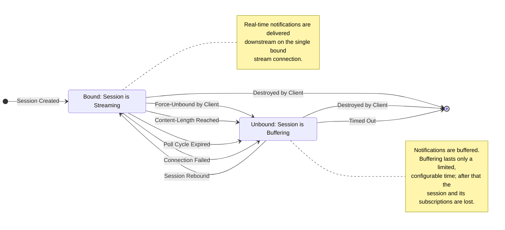

# Session Lifecycle, Rebinding and Recovery

Distilled from *TLCP Specification — Text Lightstreamer Client Protocol, version 2.5.0*. This chapter
covers the session state machine and everything that drives it: "Session Life Cycle" and "Session
Recovery" from chapter 1 (printed pp. 6–8), the whole of "Workflow Examples" (pp. 15–21), the
liveness- and rebind-relevant parameters and notifications drawn from chapters 2 and 3 (pp. 23–29,
34–36, 44–48, 61–65), chapter 4 "Special Use Cases" (pp. 66–68), the end-to-end cURL transcripts of
chapter 5 "Hands On" (pp. 69–86), and the session error/cause codes of Appendix A (pp. 88–90) and
Appendix B (p. 91). Request and notification *syntax* is owned by the request-reference and
notification-reference chapters; here we only sequence them. Every factual statement carries a
`[§Section, p.NN]` citation with the printed page number. Statements the spec does not determine are
flagged `⚠️ Spec unclear:` and are never resolved by inference.

---

## 1. Vocabulary and structural invariants

- Communication always happens inside a **session**, identified by a **session ID**
  [§Main Concepts, p.5].
- A session must be **bound to a network connection** to receive downstream real-time notifications;
  that connection is the **stream connection** of the session [§Main Concepts, p.5].
- `create_session` yields both a session and its initial stream connection; the session may later be
  bound to a *different* stream connection with a `bind_session` request [§Main Concepts, p.5].
- **A session may never be bound to more than one stream connection** [§Session Life Cycle, p.7].
- Over WS: "As long as a session is bound to a WS, no other session can be bound. After unbinding of
  a session, the same or a different session can be bound." [§WS Transport, p.13].
- Transports may be mixed: as long as the correct session ID is specified in each control request, a
  stream connection on WS may be controlled by control requests on HTTP and vice-versa
  [§Transports, p.6].
- With HTTP the stream connection is an HTTP request whose response is of (almost) infinite length,
  and, HTTP being half-duplex, **each control request requires a separate connection** parallel to the
  stream connection [§Transports, p.6]. With WS, control requests may be sent directly on the stream
  connection [§Transports, p.6].

---

## 2. The state machine

### 2.1 Normative states

The spec defines exactly two session states [§Session Life Cycle, p.6]:

> The session may be in one of 2 states:
>
> - Bound to a stream connection;
> - Unbound from a stream connection.

The state diagram on p.8 labels them **`Bound: Session is Streaming`** and
**`Unbound: Session is Buffering`** [§Session Life Cycle, p.8].

| State | Meaning | What the server does | What the client must be doing |
|---|---|---|---|
| *(none)* — pre-session | No session ID exists yet. | — | Issue `create_session`; await `CONOK` or `CONERR` [§Session Creation Request, p.22; §Session Creation and Binding Responses, pp.26–28]. |
| **Bound: Session is Streaming** | Session is attached to exactly one stream connection. | "real-time notifications are sent downstream to the stream connection for the client to consume them" [§Session Life Cycle, p.6]. | Consume the stream; count data notifications; honour keepalive expectations; may issue control requests. |
| **Unbound: Session is Buffering** | Session exists but has no stream connection. | Notifications "are buffered to be sent later" [§Session Life Cycle, p.6]; buffering "lasts only for a limited (although configurable) amount of time" [§Session Life Cycle, p.7]. | Issue `bind_session` (optionally with `LS_recovery_from`) before the buffering window expires. |
| **Destroyed** (terminal) | Session no longer exists on the Server. | Buffered events "and their originating subscriptions" are lost [§Session Life Cycle, p.7]. | Start over from `create_session` and re-execute all subscriptions [§HTTP Loop and Failed Rebind, p.19]. |

### 2.2 Normative transition table

Transcribed from the state diagram [§Session Life Cycle, p.8], with the trigger semantics
supplied from the surrounding prose and from chapters 2–3.

| # | From | To | Trigger label (verbatim from diagram, p.8) | Concrete wire cause | Client action on the transition |
|---|---|---|---|---|---|
| T1 | *initial* | Bound | `Session Created` | `create_session` answered with `CONOK,<session-ID>,<request-limit>,<keep-alive>,<control-link>` [§Successful Session Creation or Binding Response, pp.26–27]. | Record session ID, request limit, keep-alive time and control link; expect `SERVNAME`, `CLIENTIP`, `CONS` immediately after (any order) [p.27]. |
| T2 | Bound | Unbound | `Force-Unbound by Client` | Client control request `LS_op=force_rebind`; "If successful, a `LOOP` notification is sent on the stream connection. After that, real-time updates stop being delivered and the session is unbound from the connection." [§Force Session Rebind Request, p.35]. | Stop treating the stream connection as authoritative; rebind. |
| T3 | Bound | Unbound | `Content-Length Reached` | "The `Content-Length` of an HTTP stream connection has been reached" → `LOOP` sent [§Stream Connection Loop, p.64]; "the server sends the specific command *Loop* and closes the connection" [§HTTP Loop and Rebind, p.18]. | Rebind on a **new** stream connection [§HTTP Loop and Rebind, p.18]. |
| T4 | Bound | Unbound | `Poll Cycle Expired` | "The polling cycle is complete" → `LOOP` sent [§Stream Connection Loop, p.64]. | Rebind after at most `<expected-delay>` ms carried by `LOOP` [§Stream Connection Loop, p.64]. |
| T5 | Bound | Unbound | `Connection Failed` | "A stream connection is dropped by any cause" [§Session Life Cycle, p.6]. No notification is received. "upon connection drop, the session is not closed, hence the Client is still allowed to issue a rebind" [§Session Life Cycle, p.7]. | Attempt **recovery** (`bind_session` + `LS_recovery_from`), not a plain rebind — see §5. |
| T6 | Unbound | Bound | `Session Rebound` | `bind_session` answered with `CONOK` [§Session Binding Request, pp.24–26]. | Resume consuming; if `LS_recovery_from` was sent, expect `PROG` before any data notification [p.28]. |
| T7 | Bound | *final* | `Destroyed by Client` | Control request `LS_op=destroy`; "If successful, an `END` notification is sent on the stream connection. After that, real-time updates stop being delivered and the session is terminated." [§Session Destroy Request, p.36]. | Discard all session state. |
| T8 | Unbound | *final* | `Destroyed by Client` | `LS_op=destroy` issued while no stream connection is bound [§Session Life Cycle, p.7: "In order to prevent the Server from keeping the session unbound for some time, it can also request the immediate destroy of the session."]. | Discard all session state. ⚠️ Spec unclear: with no stream connection bound there is nowhere for the `END` notification of [§Session Destroy Request, p.36] to be delivered; the spec does not say whether `END` is dropped, buffered, or suppressed in this case. |
| T9 | Unbound | *final* | `Timed Out` | "when unbound, buffering lasts only for a limited (although configurable) amount of time. After that, the session is discarded and buffered events (and their originating subscriptions) are lost." [§Session Life Cycle, p.7]. A later `bind_session` then fails with `CONERR,20,...` ("Specified session not found on a `bind_session` request") [§Appendix A, p.88]. | Treat the session as definitively lost; `create_session` and re-execute all subscriptions [§HTTP Loop and Failed Rebind, p.19]. |

Additionally, the server may terminate a *bound* session unilaterally, outside the labelled edges of
the p.8 diagram: `END,<cause-code>,<cause-message>` "is sent when the Server closes the session for
some reason, e.g. on request by an administrator or as a consequence of a Session Destroy request"
[§Stream Connection End, pp.64–65]. Server-originated cause codes include `32` (closed on the Server
side, via software or by the administrator), `33`/`34` (unexpected Server error while the session was
in activity), `35` (Metadata Adapter closed this session because a new session for the same user was
opened), `40` ("A manual rebind to this session has been performed by some client"), and `48` (maximum
session duration reached — "the client should recover by opening a new session immediately")
[§Appendix A, p.89].

⚠️ Spec unclear: the p.8 diagram has no edge labelled for a server-initiated `END` on a bound
session; the diagram's only terminal edges from `Bound` are `Destroyed by Client`. The spec does not
reconcile the diagram with the `END` cause codes of Appendix A.

### 2.3 State diagram



*(Transcribed from the diagram at [§Session Life Cycle, p.8]; the two notes paraphrase
[§Session Life Cycle, pp.6–7].)*

---

## 3. Entering the session: creation

### 3.1 The creation handshake

`create_session` "provides the means to obtain an initial session ID and an initial stream connection
to receive real-time notifications" [§Session Creation Request, p.22].

On success the server emits, in this order [§Successful Session Creation or Binding Response,
pp.26–28]:

1. `CONOK,<session-ID>,<request-limit>,<keep-alive>,<control-link>`
2. then, "immediately sent (in any order)": `SERVNAME`, `CLIENTIP` (if available), `CONS`, and
   `PROG` (only if requested via `LS_recovery_from` on `bind_session`) [p.28].

On failure: `CONERR,<error-code>,<error-message>` [§Other Session Creation or Binding Responses,
p.28].

The four `CONOK` arguments each bind client behaviour for the rest of the session
[§Successful Session Creation or Binding Response, pp.26–27]:

| Argument | Lifecycle significance |
|---|---|
| `<session-ID>` | "The Server internal string representing the session ID" [p.26]. Must be echoed in every control request and every rebind (mandatory on HTTP) [§Session Binding Request, p.25]. |
| `<request-limit>` | "The maximum length allowed by the Server for a client request, expressed in bytes… this information can be useful when batching multiple control requests" [p.26]. |
| `<keep-alive>` | "The longest inactivity time guaranteed throughout connection life time, expressed in milliseconds." [p.27]. See §6. |
| `<control-link>` | If configured, "the address (IP address, or hostname, and port) to which every following session rebind and control request must be sent to, in case this requires the establishment of a new socket (possibly a websocket)"; the special value `*` means "the client should send all the session rebind and control requests to the same address to which it opened this stream connection" [p.27]. |

Control-link handover is itself a lifecycle event: "upon the first time the 'control link' address is
used to open a new stream connection to rebind to a session, the streaming activity, that was flowing
to the initial address, will switch to the 'control link'" [p.27]. Opening the new socket toward the
control-link endpoint "may be needed to ensure session affinity in case of clustering" [p.27].

⚠️ Spec unclear: `<control-link>` is documented as "the address (IP address, or hostname, and port)"
but no grammar, separator, or scheme is given for that string, and the spec does not say whether the
scheme (`http`/`https`, `ws`/`wss`) or path is inherited from the original connection.

### 3.2 `LS_reduce_head` suppresses head notifications

On `create_session`, `LS_reduce_head=true` "instructs the Server not to send the `SERVNAME` and
`CLIENTIP` notifications on this connection. Moreover, this instructs the Server not to send the
`CONS` notifications throughout all the session." [§Session Creation Request, p.24].

On `bind_session`, `LS_reduce_head=true` "instructs the Server not to send the `CONOK`, `SERVNAME`,
and `CLIENTIP` notifications on this connection" [§Session Binding Request, p.26].

State-machine consequence: on a rebind with `LS_reduce_head=true` **there is no `CONOK` to mark the
`Unbound → Bound` transition**. ⚠️ Spec unclear: the spec does not state what observable event then
signals a successful rebind, nor how a failure is distinguished from a success under
`LS_reduce_head=true` on `bind_session`.

`SERVNAME` and `CLIENTIP` "may be different for each request, even though related to the same Session;
hence [they are] reissued at each bind, unless unchanged" [§Server Name, p.62; §Client IP Address,
p.62].

### 3.3 WebSocket establishment check

`wsok` is a pseudo-request "to test a newly established WebSocket, to ensure that the communication
channel is working with no interference from intermediate nodes… the request is only allowed on a
WebSocket and it is typically expected to be the first one issued on the WebSocket. The Server will
send the response as soon as possible and, in particular, the response is guaranteed to precede the
responses of any other subsequent requests." [§WebSocket establishment check, p.47]. Response tag:
`WSOK`; "There are no error responses." [p.48].

---

## 4. The rebind / loop cycle

### 4.1 What causes it

Reasons a session becomes unbound [§Session Life Cycle, p.6]:

> - A stream connection is dropped by any cause.
> - The client may explicitly request it because it is switching to another transport (e.g. from HTTP to WS).
> - The transport may reach some limit (e.g. an HTTP 1.0 response has reached its content-length).

And, restated from the notification side [§Stream Connection Loop, p.64]:

> Reasons for a session to be rebound are mainly the following:
>
> - The polling cycle is complete.
> - The Content-Length of an HTTP stream connection has been reached.
> - A rebind has been explicitly asked by the client.
>
> In all these situations the session is unbound and a `LOOP` notification is sent. The client is
> expected to react by rebinding the session (see Session Binding Request).

### 4.2 The `LOOP` notification

`LOOP,<expected-delay>` — `<expected-delay>` is the "Expected delay before rebinding, expressed in
milliseconds" [§Stream Connection Loop, p.64]:

- "A value of `0` means that the client should rebind the session as soon as possible." [p.64]
- "A value greater than 0 is actually used only on polling sessions requested with
  `LS_polling_millis` > 0, i.e. synchronous polling. In this situation, the expected-delay may be
  lower than originally requested with `LS_polling_millis`." [p.64]
- "since this notification marks the end of the stream connection, with HTTP transport, any spurious
  character following the CR-LF of this notification may be safely ignored." [p.64]

The same "spurious character" allowance applies to `END` [§Stream Connection End, p.65].

### 4.3 HTTP vs WS on `LOOP`

| | HTTP | WS |
|---|---|---|
| Server closes the connection after `LOOP`? | Yes — "the server sends the specific command *Loop* and closes the connection" [§HTTP Loop and Rebind, p.18]. | No — "the server sends the *Loop* command exactly as in the HTTP case, but it **does not close the connection**" [§WS Long Polling, p.21]. |
| Where does the rebind go? | "The client rebinds the session to a new stream connection" [§HTTP Loop and Rebind, p.18]. | "The client is free to choose whether to rebind the session to the same stream connection or open a new one." [§WS Long Polling, p.21]. |
| Why rebinding happens at all | "usually due to an exhausted or malfunctioning stream connection. In both case keeping the connection open wouldn't help." [§WS Long Polling, p.21]. | "usually unnecessary… official Lightstreamer client libraries use it as an expedient to slow down real-time updates in a client that can't keep up with the Server." [§WS Long Polling, p.21]. |

`LS_close_socket` on `LS_op=force_rebind`: "If `true` the corresponding stream connection is forcibly
closed by the Server. If omitted, the stream connection may be left open and the client may reuse it
with both HTTP (by application-wide or system-wide connection pooling) and WS."
[§Force Session Rebind Request, p.35].

`LS_op=force_rebind` also accepts `LS_polling_millis` — "Expected time between the closing of the
connection and the next binding request, expressed in milliseconds" [§Force Session Rebind Request,
p.34].

### 4.4 What must be preserved across a rebind

| Continuity item | Rule | Citation |
|---|---|---|
| **Session ID** | Carried in `LS_session` on `bind_session`. "It is always required with HTTP transport." Optional with WS, where "the rebind will apply to the last session that was bound to the WS connection… Hence it is required that a preceding session creation or binding request took place and was fulfilled successfully." | §Session Binding Request, p.25 |
| **Subscription set** | "When this happens, the session restarts sending real-time notifications from where it stopped. In particular, all subscriptions are preserved, with all their items and fields." | §Session Life Cycle, p.7 |
| **Subscription IDs** | `LS_subId` "must be a progressive integer number starting with 1, and must be unique **within the session**" — so IDs survive rebinds and must not be reused. | §Subscription Data Model, p.9; §Subscription Request, p.29 |
| **Data progressive** | The client must keep "the count of all the notifications received since the start of the session"; this count is what `LS_recovery_from` carries. | §Session Recovery, p.8 |
| **Request-ID sequencing** | `LS_reqId` "may be any combination of letters and numbers, but typically a progressive number will do, and must be unique **within the connection**." | §Common Parameters, p.29 |

Note the deliberate asymmetry: `LS_subId` is scoped to the **session**, `LS_reqId` to the
**connection**. ⚠️ Spec unclear: "connection" in the `LS_reqId` rule is not defined — with HTTP each
control request is a separate connection [§Transports, p.6], so it is not stated whether `LS_reqId`
uniqueness is required across the whole session, per stream connection, or literally per socket. The
Hands On transcripts use a single monotonically increasing `LS_reqId` sequence per session
(`REQOK,1`, `REQOK,2`, `REQOK,3`) across separate HTTP control connections [§Basic Subscription,
pp.71–73].

By default, `bind_session` **without** `LS_recovery_from` means: "the Server will assume that all
updates sent in the previous connection (up to the `LOOP` notification) have been received by the
client and will restart from the next update." [§Session Binding Request, p.25]. That default is only
safe after a clean `LOOP`; after a connection drop it silently loses data — use recovery instead
(§5).

### 4.5 Late responses after a WS rebind

"after binding the second session, it is possible that late responses to control requests related with
the first session arrive interspersed with notifications for the second session" [§WS Transport, p.13].
With WS, "responses may always arrive interspersed with notifications, when control requests are sent
on the stream connection" [§WS Transport, p.13].

---

## 5. Session recovery

### 5.1 When it applies

"In case of an unexpected interruption of a stream connection, the Client can try to rebind to the same
session and resume the notification flow from the exact point it was interrupted."
[§Session Recovery, p.8].

Also — recovery does **not** require the server to have closed anything: "an interruption of the
connection on the Server side is not needed to perform a recovery action. For instance, if a
connection becomes mute, the client can issue a recovery request, even though, perhaps, the
notification flow is just being delayed somewhere." [§Session Recovery, p.8].

**Point of no return:** "once issued, the recovery request invalidates any further notifications (of
any type) that may be later received on the original connection." [§Session Recovery, p.8].

### 5.2 The four preconditions (verbatim)

[§Session Recovery, p.8]:

> 1. The count of all the notifications received since the start of the session has been kept. More
>    precisely, the notifications to be counted are the ones related with the subscription and message
>    activity (as reported below in Real-Time Update, Other Subscription-Related Notifications, and
>    Message-Related Notifications). We will call them "data notifications".
>
> 2. A special binding request is issued, in which the count of all the received data notifications is
>    specified as the requested starting point.
>
> 3. The Server, upon reception of the binding request, has kept the session alive and has stored all
>    data notifications already sent since the point requested. The amount of sent data stored and the
>    time it is kept depend on Server configuration.
>    If this is available, the stream connection will start successfully and, before sending any data
>    notification, the Server will specify, through a proper notification, the modified starting point,
>    which, however, may also be lower (i.e. earlier) than requested.
>
> 4. If the starting point of the received flow is lower than requested, the first data notifications
>    received are discarded, until the desired point is reached.

### 5.3 What counts as a "data notification"

Data notifications are exactly those in the three named notification groups
[§Session Recovery, p.8, cross-referencing §Real-Time Update p.49, §Other Subscription-Related
Notifications p.53, §Message-Related Notifications p.59]:

- **Real-Time Update**: `U` [§Real-Time Update, p.49].
- **Other Subscription-Related Notifications**: `SUBOK`, `SUBCMD`, `UNSUB`, `EOS`, `CS`, `OV`, `CONF`
  [§Other Subscription-Related Notifications, pp.53–56].
- **Message-Related Notifications**: `MSGDONE`, `MSGFAIL` [§Message-Related Notifications, pp.59–60].

Everything else is **not** counted: "The described mechanism only involves the data notifications; any
other notifications received must always be treated as usual: they are not related with data, but only
with the session and connection lifecycle and are also not meant to be resumed."
[§Session Recovery, p.8]. That excludes the Session-Related group — `CONS`, `SYNC`, `CLIENTIP`,
`SERVNAME`, `PROG`, `NOOP`, `PROBE`, `LOOP`, `END` [§Session-Related Notifications, pp.61–65] — as
well as `CONOK`/`CONERR` and control responses `REQOK`/`REQERR`/`ERROR`.

The Hands On worked example confirms the counting rule: "The count should start with the `SUBOK`
notification and include the `CONF` and all the `U` notifications. In our example, the count yields
15." [§Session Recovery (Hands On), p.77].

⚠️ Spec unclear: the **MPN-Related Notifications** group (`MPNREG`, `MPNZERO`, `MPNOK`, `MPNCONF`,
`MPNDEL`) [§MPN-Related Notifications, pp.57–59] is listed in neither the "data notification" set nor
the excluded set of [§Session Recovery, p.8]. The spec does not say whether MPN notifications count
toward the recovery progressive.

### 5.4 The wire exchange

- Request parameter: `LS_recovery_from` on `bind_session` — "Progressive number of the last data
  notification received in the session (or, equivalently, total number of data notifications received
  from the beginning of the session), to be used to determine the starting point for the response flow…
  This will also cause a `PROG` notification to be issued on the response before any data notification."
  [§Session Binding Request, p.25].
- Server answer: `PROG,<progressive>` — "The progressive number of the last data notification already
  sent (or, equivalently, the total count of data notifications already sent); the response flow will
  start from this point." [§Progressive of Last Data Notification, p.63].
- `PROG` is "sent only when requested via `LS_recovery_from` on `bind_session` requests. The specified
  progressive should be the same as the one specified through `LS_recovery_from`, but actually it can
  be lower. In this case, the initial data notifications received must be skipped, until the required
  progressive number is reached. However, any notification of different kind received must always be
  obeyed." [§Progressive of Last Data Notification, p.63].
- Ordering: `PROG` is one of the notifications sent immediately after `CONOK`
  [§Successful Session Creation or Binding Response, p.28].

⚠️ Spec unclear: `PROG` "can be lower" than requested, but the spec never states whether it can be
*higher* than requested, nor what a client must do if it is. [§Progressive of Last Data Notification,
p.63].

### 5.5 Recovery failure

`CONERR,4,...` — "The progressive specified on a `bind_session` request to recovery from has not been
kept by the Server, hence the recovery attempt failed." [§Appendix A, p.88].

### 5.6 Recovery is not a special streaming mode

"upon the successful response to a recovery request, the streaming is resumed normally. For instance,
the stream connection carrying recovery data may terminate and ask for a further rebind before all
notifications to be recovered are sent; in this case, a normal rebind will be enough to furtherly
resume the notification flow." [§Session Recovery, p.8].

---

## 6. When the session is definitively lost

### 6.1 Rebind failure causes (verbatim)

[§HTTP Loop and Failed Rebind, p.19]:

> - If **too much time** passes since the end of the previous stream connection, the Server **deletes**
>   the old session.
> - If the Server has been shut down and a brand new instance is now responding on the same port.
> - If there is a **cluster** of Lightstreamer Server behind a load balancer, it is possible that for the
>   new stream connection the client is connected to a **different** Server that will not recognize the
>   old session (see the *Clustering* document on how to avoid it).
>
> In this situation, the client should create a **new stream connection**, as if it was the first time
> it connects to the Server, and re-execute all the **subscriptions** that were active at the moment
> the previous stream connection terminated.

And the permanent case [§HTTP Loop and Failed Rebind, p.20]:

> By the way, in the last error case described above (i.e. a cluster of Servers with incorrect
> affinity), the issue is permanent and will not be overcome by a reconnection but only by fixing the
> configuration. The Server tries to recognize this case and use a different error code.

### 6.2 Mapping causes to codes

Session-level codes returned via `CONERR` on `bind_session`, or via `END` [§Appendix A, pp.88–90]:

| Code | Meaning (verbatim) | Recoverable by re-creating a session? |
|---|---|---|
| `3` | "The session specified on a `bind_session` request was initiated with a different and incompatible communication protocol or protocol version." | — |
| `4` | "The progressive specified on a `bind_session` request to recovery from has not been kept by the Server, hence the recovery attempt failed." | — |
| `20` | "Specified session not found on a `bind_session` request." | This is the "too much time passed" / session-deleted case of p.19. |
| `21` | "The session ID specified in a `bind_session` request is not compatible with this Server instance and it is not likely to pertain to an instance just closed; it might pertain to a different instance." | This is the "different error code" for the permanent cluster-affinity case of p.20. |
| `31` | "The session was closed (possibly by the administrator) through a client destroy request." | — |
| `32` | "The session was closed on the Server side, via software or by the administrator." | — |
| `33`, `34` | "An unexpected error occurred on the Server while the session was in activity." | — |
| `35` | "The Metadata Adapter only allows a limited number of sessions for the current user and has requested the closure of the current session upon opening of a new session for the same user by some client." | — |
| `40` | "A manual rebind to this session has been performed by some client." | — |
| `48` | "The maximum session duration has been reached… This is only meant as a way to refresh the session (for instance, to force a different association in a clustering scenario), hence the client should recover by opening a new session immediately." | Yes, explicitly. |
| `≤0` | "If the code is 0 or negative, it has been supplied by the Metadata Adapter and the interpretation is application-specific. In particular if used with and `END` notification, means the session was closed by an Administrator with a destroy command and the code was supplied as a custom cause code." | — |

Control-request-level codes are separate [§Appendix B, p.91]; the lifecycle-relevant ones are
`REQERR`/`ERROR` code `20` "Specified (or implied) session not found." and code `11` "The specified
session ID is not compatible with this Server instance and it is not likely to pertain to an instance
just closed; it might pertain to a different instance." [§Appendix B, p.91].

⚠️ Spec unclear: the mapping of the second failure cause on p.19 ("the Server has been shut down and
a brand new instance is now responding on the same port") to a specific `CONERR` code is not stated;
the spec only distinguishes the cluster-affinity case (code `21`) by wording.

⚠️ Spec unclear: the spec never states which codes are retryable and with what backoff, beyond the
qualitative advice "retry later" for codes `5` and `6` [§Appendix A, p.88] and "immediately" for `48`
[§Appendix A, p.89]. No timings are given.

### 6.3 Deliberate abandonment

"When the Client wants to abandon a session, it can simply drop the connection (if currently bound) and
refrain from binding again. In order to prevent the Server from keeping the session unbound for some
time, it can also request the immediate destroy of the session." [§Session Life Cycle, p.7].

The Hands On chapter makes the same point operationally: "Disconnecting from a stream connection is
done by simply closing the underlying socket. The Server automatically detects the connection
termination and destroys the session, freeing up its resources… In particular cases where a network
appliance in the middle (such as a reverse proxy) may keep the connection alive, a control request may
be sent to forcefully destroy the session on the Server." [§Disconnection, p.73].

⚠️ Spec unclear: [§Disconnection, p.73] says closing the socket makes the Server "destroy the
session", while [§Session Life Cycle, p.7] says that on connection drop "the session is not closed,
hence the Client is still allowed to issue a rebind" and it is only discarded after the buffering
timeout. The spec does not reconcile these two statements. The Server configuration elements named in
the Hands On setup notes are `<session_timeout_millis>` and `<session_recovery_millis>`
[§Server Setup, p.70], but their defaults and exact semantics are not given in this spec.

---

## 7. Long polling

### 7.1 The cycle (verbatim)

[§Session Life Cycle, p.7]:

> Long polling works as follows:
>
> 1. An initial stream connection is created with a **limited life-time** (e.g. a few seconds).
>
> 2. During this life-time, if real-time notifications are available they are sent and the session is
>    unbound immediately after that, **closing the stream connection**. In this way, caching appliances
>    in the middle **flush their cache** and notifications can be received with minimum latency.
>
> 3. If no real-time notifications are available, when this life-time expires the Server unbinds the
>    sessions anyway and closes the stream connection.
>
> 4. A new stream connection is immediately re-established by the client with a **binding** request,
>    and the loop restarts from point 2.

"While it applies particularly well to HTTP cases, this communication mode is transport independent
and may also be applied to WS under particular circumstances, such as to forcibly slow down a
connection with a client that can't keep up on high frequency updates."
[§Session Life Cycle, p.7].

### 7.2 Polling parameters

Present on both `create_session` and `bind_session` [§Session Creation Request, p.23;
§Session Binding Request, p.25]:

| Parameter | Rule |
|---|---|
| `LS_polling` | "Requests a polling connection. If set to `true`, the Server will send only the notifications that are ready at connection time and will exit immediately, keeping the session active for subsequent rebind requests." |
| `LS_polling_millis` | "Only if `LS_polling` is `true`. Expected time between the closing of the connection and the next polling connection… Required by the Server in order to ensure that the underlying session is kept active across polling connections. If too high, the Server may apply a configured maximum time. Anyway, the timeout used is notified to the client in the response." |
| `LS_idle_millis` | "Only if `LS_polling` is `true`. Optional. Time the Server is allowed to wait for a notification, if none is present at request time… If zero or not specified, the Server response will be synchronous and might be empty. If positive, the Server response will be asynchronous and, if the specified timeout expires, might be empty. If too high, the Server may apply a configured maximum time." |

On a polling connection the `<keep-alive>` argument of `CONOK` changes meaning: "for a polling
connection, if the response has not been supplied for this time, an empty response is issued. In
practice, this value corresponds to the requested `LS_idle_millis` (but for a possible Server upper
limit)." [§Successful Session Creation or Binding Response, p.27].

`SYNC` and `PROBE` notifications "are not sent on polling connections" [§Time Synchronization, p.61;
§Probe (Keep-Alive), p.64].

⚠️ Spec unclear: `LS_polling_millis` is described as the value the Server uses to keep the session
alive between polling connections, and "the timeout used is notified to the client in the response"
[§Session Creation Request, p.23], but the spec does not name which response argument or notification
carries it. `CONOK` has no dedicated argument for it [§Successful Session Creation or Binding
Response, pp.26–27]; `LOOP,<expected-delay>` is only described as the delay *before* rebinding
[§Stream Connection Loop, p.64].

---

## 8. Liveness

### 8.1 Server → client: `PROBE`

`PROBE` (zero arguments) "is sent periodically by the Server when no other activity has been sent on
the stream connection. The interval is specified in the Server configuration, but it may be changed
during session creation; the actual interval is reported in the session creation response. The
notifications are not sent on polling connections." [§Probe (Keep-Alive), pp.63–64].

Detection rule, stated as what official libraries do: "Official Lightstreamer client libraries monitor
this notification to detect when the connection is stalled: if after the expected interval plus a
configurable timeout no `PROBE` has been received, the connection is closed and reopened."
[§Probe (Keep-Alive), p.64].

⚠️ Spec unclear: the "configurable timeout" added to the keepalive interval before declaring a stall
is entirely client-side and the spec gives no value or range for it [§Probe (Keep-Alive), p.64].

Negotiation, via `LS_keepalive_millis` on `create_session` / `bind_session`: "Only if `LS_polling` is
not `true`. Optional. Longest inactivity time allowed for the connection, expressed in milliseconds.
If such a long inactivity occurs, the Server sends a keepalive message (i.e. a `PROBE` notification).
If too low, the Server may apply a configured minimum time. If too high, the Server will apply a
configured maximum time. If not present, the keepalive time is decided by the Server, based on its own
configuration. Anyway, the keepalive time used is notified to the client in the response."
[§Session Creation Request, pp.23–24; §Session Binding Request, pp.25–26].

The negotiated value is the third `CONOK` argument: "`<keep-alive>` — The longest inactivity time
guaranteed throughout connection life time, expressed in milliseconds. For a stream connection, when
no notifications have been sent for this time, a `PROBE` notification is sent to the client… Not
receiving any message for longer than this time may be the signal of a problem."
[§Successful Session Creation or Binding Response, p.27].

In every Hands On transcript the negotiated keepalive is `5000` ms and the request limit `50000`
bytes, e.g. `CONOK,S1d7c802482843a26T5626355,50000,5000,*` [§Connection and Session Creation, p.70].
These are that installation's values, not protocol defaults.

### 8.2 Server → client: `SYNC`

`SYNC,<seconds-since-initial-header>` — "Time elapsed on the Server since the session was bound,
expressed in seconds… This notification is sent periodically to notify the client of the time elapsed
on the Server. Official Lightstreamer client libraries exploit this notification to detect when they
are not keeping up with the current flow of real-time updates. The notifications are not sent on
polling connections." [§Time Synchronization, p.61].

Note the reset semantics: the counter is relative to **when the session was bound**, so it restarts on
every rebind. This is visible in the Hands On recovery transcript, where `SYNC,25` on the first stream
connection is followed by `SYNC,5` on the recovery connection [§Session Recovery (Hands On),
pp.77–78].

Suppression: `LS_send_sync=false` "instructs the Server not to send the `SYNC` notifications on this
connection. If omitted, the default is `true`." Only valid if `LS_polling` is not `true`
[§Session Creation Request, p.24; §Session Binding Request, p.26].

### 8.3 Server → client: `NOOP`

`NOOP,<preamble>` — "The purpose of this notification is to fill the receive buffer of the client
browser or the operating system during the initial setup phase of the session… certain operating
systems buffer the content of an HTTP response until some specific length (e.g. 2 Kbytes).
Preemptively filling this buffer lets the client receive subsequent content as soon as it is sent by
the Server." [§No Operation, p.63]. Observed value in transcripts: `NOOP,sending placeholder data`
[§Connection and Session Creation, p.70].

⚠️ Spec unclear: the number of `NOOP` lines emitted, and whether they count toward the HTTP
Content-Length budget that eventually triggers `LOOP`, is not stated.

### 8.4 Client → server: `LS_inactivity_millis` and `heartbeat`

`LS_inactivity_millis` on `create_session` / `bind_session`: "Only if `LS_polling` is not `true`.
Optional. Maximum time the Client is committed to wait before issuing a request to the Server while
this connection is open. If no request is needed, a heartbeat pseudo-request can be sent. If no request
is received for more than this time, the Server can assume that the client is stuck and act
accordingly." [§Session Creation Request, p.23; §Session Binding Request, p.25].

The `heartbeat` pseudo-request "has the sole purpose of keeping the client-server communication
channel engaged. This can serve various purposes" [§Client Heartbeat, pp.45–46]:

> 1. Preventing the communication infrastructure from closing an inactive socket that is ready for reuse
>    for more HTTP control requests, to avoid connection reestablishment overhead. However it is not
>    guaranteed that the connection will be kept open, as the underlying TCP implementation may open a
>    new socket each time a HTTP request needs to be sent.
>
> 2. Detecting when a WebSocket connection has been interrupted but not explicitly closed.
>
> 3. Allowing the Server to detect cases in which the client is stuck but the socket of the stream
>    connection is kept open by some intermediate node.
>    This must be done in combination with supplying the `LS_inactivity_millis` parameter to the
>    `create_session` and `bind_session` requests.

Key economy rule: "**any Control Request has the same effect of a Heartbeat**, hence no Heartbeat is
needed as long as Control Requests are sent." [§Client Heartbeat, p.46].

`LS_session` on `heartbeat` "is only needed for the purpose 3 above, whereby the client declares that
it is still listening to the stream connection for the specified session." Optional with WS, where it
defaults to "the last session that was bound to the WS connection (it may be currently still bound or
temporarily unbound due to a polling cycle), if any." [§Client Heartbeat, p.46].

Responses: "The response is returned only with HTTP transport. With WS transport there is no response,
but for the case an of error in the formulation of the request." Successful response is a bare `REQOK`
(no request-ID argument), and "there is no error if the specified session is not found."
[§Client Heartbeat, pp.46–47].

⚠️ Spec unclear: the spec says the Server "can assume that the client is stuck and act accordingly"
if no request arrives within `LS_inactivity_millis` [§Session Creation Request, p.23], but never
states what the Server actually does — whether it unbinds, destroys the session, or sends `END`.

⚠️ Spec unclear: no default value or recommended value is given for `LS_inactivity_millis`, and no
guidance on how often the client should send `heartbeat` relative to it.

### 8.5 Content-length as a forced-rebind mechanism

`LS_content_length` on `create_session` / `bind_session`: "Optional. Content-Length to be used for the
connection content, expressed in bytes. If too low or not present, the Content-Length is assigned by
Lightstreamer Server, based on its own configuration." [§Session Creation Request, p.23;
§Session Binding Request, p.25].

Reaching it terminates the stream connection with `LOOP` [§Stream Connection Loop, p.64;
§HTTP Loop and Rebind, p.18]. The Hands On chapter demonstrates it with
`LS_content_length=10000` — "The Content-Length is forcefully limited to 10 Kbytes" — noting that with
a fast-moving item "the stream connection reaches its content-length in a just a few minutes"
[§Session Rebinding (Hands On), pp.74–75].

Interaction with `LS_op=destroy`: a custom `LS_cause_message` "should be short. If longer than 35
characters and if a content-length limit on the connection content is in force, it may be replaced with
`[Custom message skipped]`." [§Session Destroy Request, p.35].

### 8.6 Per-request deadline: `LS_ttl_millis`

On `create_session`: "Maximum time the client is committed to wait for an answer to this request before
giving up, expressed in milliseconds. This information allows the Server to interrupt the processing of
the request and discard it if it detects that the specified time limit cannot be obeyed."
[§Session Creation Request, p.24]. Special values: `unknown` — "the request is kept until completion.
This is also the default behavior"; `unlimited` — "similar to `unknown`, but, in this case, the request
is kept also if the Server is overloaded". Also: "A request can also be discarded before completion
(with error code 5) when the Server is overloaded and it determines that a significant delay is still
going to be accumulated." [§Session Creation Request, p.24].

### 8.7 Summary of liveness knobs

| Direction | Mechanism | Negotiated by | Reported back as | Suppressed by |
|---|---|---|---|---|
| Server → client | `PROBE` | `LS_keepalive_millis` [p.23] | `CONOK` arg 3 `<keep-alive>` [p.27] | polling mode [p.64] |
| Server → client | `SYNC` | — | — | `LS_send_sync=false` [p.24] |
| Server → client | `NOOP` | — | — | ⚠️ Spec unclear: no parameter documented |
| Server → client | empty polling response | `LS_idle_millis` [p.23] | `CONOK` arg 3 `<keep-alive>` [p.27] | non-polling mode |
| Client → server | `heartbeat` / any control request | `LS_inactivity_millis` [p.23] | — | — |
| Server → client | `SERVNAME`, `CLIENTIP`, `CONS` head | — | — | `LS_reduce_head=true` [p.24] |

**All the timing values above are server-configuration-dependent.** The spec states minima/maxima are
"configured" on the Server for `LS_keepalive_millis` [p.23], `LS_polling_millis` [p.23],
`LS_idle_millis` [p.23] and `LS_content_length` [p.23], and that the amount of recovery data stored
and how long it is kept "depend on Server configuration" [§Session Recovery, p.8]. ⚠️ Spec unclear:
**no numeric default is given anywhere in this document for any of these.** A client must treat the
values echoed in `CONOK` as the only authoritative timings.

---

## 9. Workflow sequences

The following are transcriptions of the sequence diagrams in chapter 1's "Workflow Examples"
(pp. 15–21). Numbering and arrow labels are as printed.

### 9.1 Basic Subscription

Prose [§Basic Subscription, p.15]:

> - The client **opens** the stream connection with the Server, which accepts the connection.
> - Then, the client **subscribes** to the item *item1* (with the related field schema *schema1*) and the
>   Server starts sending real-time updates to the client.
> - The client **unsubscribes** from the item *item1*, the Server stops sending real-time updates.
>   Note that real-time updates may follow the unsubscription request response, but not the
>   unsubscription notification.
> - Finally the client **closes** the stream connection.

**HTTP transport** [p.15] — note the three separate connections: `Stream Connection`,
`Control Connection 1`, `Control Connection 2`:

```
 1: Connect                        Client → Stream Connection
 2: Create Session                 Client → Stream Connection
 3: Connect                        Client → Control Connection 1
 4: Subscription (item1, Schema1)  Client → Control Connection 1
 5: OK                             Control Connection 1 → Client
    (Control Connection 1 closed)
 6: Confirm Subscription (item1)   Stream Connection → Client
 7: Data (item1, Schema1)          Stream Connection → Client
 8: Data (item1, Schema1)          Stream Connection → Client
 9: Data (item1, Schema1)          Stream Connection → Client
10: Connect                        Client → Control Connection 2
11: Unsubscription (item1)         Client → Control Connection 2
12: OK                             Control Connection 2 → Client
    (Control Connection 2 closed)
13: Data (item1, Schema1)          Stream Connection → Client
14: Confirm Unsubscription (item1) Stream Connection → Client
15: Disconnect                     Client → Stream Connection
    (Stream Connection closed)
```

Ordering invariant to test: step 13 (`Data`) arrives **after** step 12 (`OK` to the unsubscription) but
**before** step 14 (`UNSUB`) — matching the prose "real-time updates may follow the unsubscription
request response, but not the unsubscription notification" [§Basic Subscription, p.15].

**WS transport** [p.15] — single connection throughout:

```
 1: Connect                        Client → Stream Connection
 2: Create Session                 Client → Stream Connection
 3: Subscription (item1, Schema1)  Client → Stream Connection
 4: OK                             Stream Connection → Client
 5: Confirm Subscription (item1)   Stream Connection → Client
 6: Data (item1, Schema1)          Stream Connection → Client
 7: Data (item1, Schema1)          Stream Connection → Client
 8: Data (item1, Schema1)          Stream Connection → Client
 9: Unsubscription (item1)         Client → Stream Connection
10: OK                             Stream Connection → Client
11: Data (item1, Schema1)          Stream Connection → Client
12: Confirm Unsubscription (item1) Stream Connection → Client
13: Disconnect                     Client → Stream Connection
    (Stream Connection closed)
```

### 9.2 Double Subscription

Prose [§Double Subscription, p.16]: client subscribes *item1*/*schema1*, then *item2*/*schema2*, then
"unsubscribes from *item2*, the Server stops sending real-time updates for *item2* but continues
sending them for *item1*."

**HTTP transport** [p.16] — three control connections, one per control request:

```
 1: Connect                        Client → Stream Connection
 2: Create Session                 Client → Stream Connection
 3: Connect                        Client → Control Connection 1
 4: Subscription (item1, Schema1)  Client → Control Connection 1
 5: OK                             Control Connection 1 → Client
 6: Confirm Subscription (item1)   Stream Connection → Client
 7: Data (item1, Schema1)
 8: Data (item1, Schema1)
 9: Connect                        Client → Control Connection 2
10: Subscription (item2, Schema2)  Client → Control Connection 2
11: OK                             Control Connection 2 → Client
12: Data (item1, Schema1)
13: Confirm Subscription (item2)   Stream Connection → Client
14: Data (item2, Schema2)
15: Data (item1, Schema1)
16: Data (item2, Schema2)
17: Connect                        Client → Control Connection 3
18: Unsubscription (item2)         Client → Control Connection 3
19: OK                             Control Connection 3 → Client
20: Data (item2, Schema2)
21: Confirm Unsubscription (item2) Stream Connection → Client
22: Data (item1, Schema1)
23: Data (item1, Schema1)
```

**WS transport** [p.16]:

```
 1: Connect                        Client → Stream Connection
 2: Create Session
 3: Subscription (item1, Schema1)
 4: OK
 5: Confirm Subscription (item1)
 6: Data (item1, Schema1)
 7: Data (item1, Schema1)
 8: Subscription (item2, Schema2)
 9: OK
10: Data (item1, Schema1)
11: Confirm Subscription (item2)
12: Data (item2, Schema2)
13: Data (item1, Schema1)
14: Data (item2, Schema2)
15: Unsubscription (item2)
16: OK
17: Data (item2, Schema2)
18: Confirm Unsubscription (item2)
19: Data (item1, Schema1)
20: Data (item1, Schema1)
```

### 9.3 Field Schema Change

Prose [§Field Schema Change, p.17]: "The client decides to change the subscription field schema, so it
**unsubscribes** from *item1* (and the Server stops sending real-time updates for *item1*) and then
**re-subscribes** to *item1* with the new field schema *schema2*."

Lifecycle point: there is no in-place schema change; it is `delete` then `add`.

**HTTP transport** [p.17]:

```
 1: Connect                        Client → Stream Connection
 2: Create Session
 3: Connect                        Client → Control Connection 1
 4: Subscription (item1, Schema1)
 5: OK
 6: Confirm Subscription (item1)
 7: Data (item1, Schema1)
 8: Data (item1, Schema1)
 9: Connect                        Client → Control Connection 2
10: Unsubscription (item1)
11: OK
12: Data (item1, Schema1)
13: Confirm Unsubscription (item1)
14: Connect                        Client → Control Connection 3
15: Subscription (item1, Schema2)
16: OK
17: Confirm Subscription (item1)
18: Data (item1, Schema2)
19: Data (item1, Schema2)
```

**WS transport** [p.17]:

```
 1: Connect
 2: Create Session
 3: Subscription (item1, Schema1)
 4: OK
 5: Confirm Subscription (item1)
 6: Data (item1, Schema1)
 7: Data (item1, Schema1)
 8: Unsubscription (item1)
 9: OK
10: Data (item1, Schema1)
11: Confirm Unsubscription (item1)
12: Subscription (item1, Schema2)
13: OK
14: Confirm Subscription (item1)
15: Data (item1, Schema2)
16: Data (item1, Schema2)
```

### 9.4 HTTP Loop and Rebind

Prose [§HTTP Loop and Rebind, p.18]: "When the *Content-Length* **is reached**, the server sends the
specific command *Loop* and closes the connection. The client rebinds the session to a new stream
connection and real-time updates restart."

```
 1: Connect                        Client → Stream Connection 1
 2: Create Session
 3: Connect                        Client → Control Connection 1
 4: Subscription (item1, Schema1)
 5: OK
 6: Confirm Subscription (item1)
 7: Data (item1, Schema1)
 8: Data (item1, Schema1)
 9: Connect                        Client → Control Connection 2
10: Subscription (item2, Schema2)
11: OK
12: Confirm Subscription (item2)
13: Data (item2, Schema2)
14: Data (item1, Schema1)
                                   [note: "The Content-Length is reached"]
15: Loop                           Stream Connection 1 → Client
16: Disconnect                     (Stream Connection 1 closed)
17: Connect                        Client → Stream Connection 2
18: Bind Session                   Client → Stream Connection 2
19: Data (item1, Schema1)          Stream Connection 2 → Client
20: Data (item2, Schema2)          Stream Connection 2 → Client
```

Note that **both** subscriptions resume on the new stream connection with no re-subscription — the
p.7 guarantee "all subscriptions are preserved, with all their items and fields"
[§Session Life Cycle, p.7].

### 9.5 HTTP Loop and Failed Rebind

```
 1: Connect                        Client → Stream Connection 1
 2: Create Session
 3: Connect                        Client → Control Connection 1
 4: Subscription (item1, Schema1)
 5: OK
 6: Confirm Subscription (item1)
 7: Data (item1, Schema1)
 8: Data (item1, Schema1)
                                   [note: "The Content-Length is reached"]
 9: Loop                           Stream Connection 1 → Client
10: Disconnect                     (Stream Connection 1 closed)
11: Connect                        Client → Stream Connection 2
12: Bind Session                   Client → Stream Connection 2
13: Error                          Stream Connection 2 → Client
                                   [note: "The Bind operation fails"]
                                   (Stream Connection 2 closed)
14: Connect                        Client → Stream Connection 3
15: Create Session                 Client → Stream Connection 3
16: Connect                        Client → Control Connection 2
17: Subscription (item1, Schema1)  ← re-executed from scratch
18: OK
19: Confirm Subscription (item1)
20: Data (item1, Schema1)
```

The recovery obligation is the whole point of this diagram: "the client should create a **new stream
connection**, as if it was the first time it connects to the Server, and re-execute all the
**subscriptions** that were active at the moment the previous stream connection terminated."
[§HTTP Loop and Failed Rebind, p.19].

⚠️ Spec unclear: on re-creating the session, `LS_subId` must again start at 1 for the new session
[§Subscription Data Model, p.9], but the spec does not say whether a client is expected to preserve
its old subscription-ID → group/schema mapping or renumber. It also does not address the fate of the
data-notification progressive counter, which necessarily restarts at zero for the new session.

### 9.6 WS Long Polling (Loop and Rebind — WS Transport)

Prose [§WS Long Polling, p.21]: "When the **poll cycle ends**, the server sends the *Loop command* and
unbinds the session. The client then rebinds the session to the **same** stream connection and
real-time updates restart."

```
 1: Connect                        Client → Stream Connection 1
 2: Create Session
 3: Subscription (item1, Schema1)
 4: OK
 5: Confirm Subscription (item1)
 6: Data (item1, Schema1)
 7: Data (item1, Schema1)
 8: Subscription (item2, Schema2)
 9: OK
10: Confirm Subscription (item2)
11: Data (item2, Schema2)
12: Data (item1, Schema1)
                                   [note: "The long-polling cycle ends"]
13: Loop                           Stream Connection 1 → Client
14: Bind Session                   Client → Stream Connection 1   (same socket)
15: OK
16: Data (item1, Schema1)
17: Data (item2, Schema2)
```

Note that on WS the diagram shows no `Disconnect` between 13 and 14, consistent with "it **does not
close the connection**" [§WS Long Polling, p.21].

⚠️ Spec unclear: step 15 of the WS diagram is labelled `OK`, whereas
[§Successful Session Creation or Binding Response, p.26] specifies `CONOK` as the response to a
binding request. The diagrams use generic labels; the notification chapter is authoritative on the
actual tag.

---

## 10. Verbatim transcripts (integration-test fixtures)

All transcripts below are reproduced exactly as printed in chapter 5, "Hands On" (pp. 69–86). The
server used is a stock Lightstreamer installation on `localhost:8080` with the `WELCOME` Adapter Set,
`STOCKS` and `CHAT` Data Adapters, and items `item1`…`item30` [§Server Setup, p.69]. cURL command lines
are printed wrapped in the PDF; **each is a single line** [§Connection and Session Creation, p.70].
Line separator on the wire is CR-LF throughout [§Common Response and Notification Syntax, p.13] —
"forging sample requests by starting from a copy-and-paste from our examples may not yield correct
requests, depending on your editor end-of-line settings. Please always ensure the presence of the full
CR-LF instead of only CR or only LF." [§Request/Response Reference, p.22].

### F1 — Session creation (HTTP) [§Connection and Session Creation, pp.70–71]

Request:

```
curl -v -N -X POST -d "LS_adapter_set=WELCOME&LS_cid=mgQkwtwdysogQz2BJ4Ji%20kOj2Bg"
http://localhost:8080/lightstreamer/create_session.txt?LS_protocol=TLCP-2.5.0
```

Response stream:

```
CONOK,S1d7c802482843a26T5626355,50000,5000,*
SERVNAME,Lightstreamer HTTP Server
CLIENTIP,0:0:0:0:0:0:0:1
NOOP,sending placeholder data
[…]
NOOP,sending placeholder data
CONS,unlimited
PROBE
PROBE
PROBE
[…]
```

Annotation from the spec [pp.70–71]: `CONOK` carries "the session ID (underlined), request limit, keep
alive time and control link"; the `NOOP`s are "needed to fill up the receive buffer of the client";
`CONS` carries "the maximum bandwidth allowed (`unlimited` means no limit)"; and "repeating each 5
seconds, a `PROBE` notification to keep the stream connection alive."

### F2 — Subscribe on a separate control connection [§Subscription to an Item, p.71]

Request:

```
curl -v -N -X POST -d
"LS_op=add&LS_subId=1&LS_data_adapter=STOCKS&LS_group=item1&LS_schema=stock_name time
last_price&LS_mode=MERGE&LS_session=<session-ID>&LS_reqId=1"
http://localhost:8080/lightstreamer/control.txt?LS_protocol=TLCP-2.5.0
```

Response on the control connection:

```
REQOK,1
```

New notifications on the *stream* connection:

```
[…]
PROBE
SYNC,14
SUBOK,1,1,3
CONF,1,unlimited,filtered
PROBE
[…]
```

### F3 — Real-time updates [§Receive Some Data, p.72]

```
[…]
PROBE
U,1,1,Anduct|11:02:33|3.11
PROBE
[…]

[…]
PROBE
SYNC,102
U,1,1,|11:03:39|
PROBE
[…]

[…]
PROBE
U,1,1,|11:04:29|3.09
PROBE
[…]
```

### F4 — Unsubscribe [§Unsubscription from an Item, pp.72–73]

```
curl -v -N -X POST -d "LS_op=delete&LS_subId=1&LS_session=<session-ID>&LS_reqId=2"
http://localhost:8080/lightstreamer/control.txt?LS_protocol=TLCP-2.5.0
```

Control response, then stream notification:

```
REQOK,2
```

```
UNSUB,1
```

### F5 — Explicit destroy [§Disconnection, p.73]

```
curl -v -N -X POST -d "LS_op=destroy&LS_session=<session-ID>&LS_reqId=3"
http://localhost:8080/lightstreamer/control.txt?LS_protocol=TLCP-2.5.0
```

Control response, then final stream notification:

```
REQOK,3
```

```
END,31,Destroy invoked by client
```

Code `31` is "The session was closed (possibly by the administrator) through a client destroy request."
[§Appendix A, p.89], and is the default when `LS_cause_code` is not supplied
[§Session Destroy Request, p.35].

### F6 — Forcing a `LOOP` via content-length [§Session Rebinding (Hands On), pp.74–75]

Session creation with a 10 KB budget:

```
curl -v -N -X POST -d "LS_adapter_set=WELCOME&LS_cid=mgQkwtwdysogQz2BJ4Ji
%20kOj2Bg&LS_content_length=10000"
http://localhost:8080/lightstreamer/create_session.txt?LS_protocol=TLCP-2.5.0
```

```
CONOK,Se939a67a9be2d336T3823582,50000,5000,*
SERVNAME,Lightstreamer HTTP Server
CLIENTIP,0:0:0:0:0:0:0:1
NOOP,sending placeholder data
[…]
NOOP,sending placeholder data
CONS,unlimited
PROBE
PROBE
PROBE
[…]
```

Two subscriptions, on separate control connections:

```
curl -v -N -X POST -d
"LS_op=add&LS_subId=1&LS_data_adapter=STOCKS&LS_group=item1&LS_schema=stock_name time
last_price&LS_mode=MERGE&LS_session=<session-ID>&LS_reqId=1"
http://localhost:8080/lightstreamer/control.txt?LS_protocol=TLCP-2.5.0

curl -v -N -X POST -d
"LS_op=add&LS_subId=2&LS_data_adapter=STOCKS&LS_group=item2&LS_schema=stock_name time
last_price&LS_mode=MERGE&LS_session=<session-ID>&LS_reqId=2"
http://localhost:8080/lightstreamer/control.txt?LS_protocol=TLCP-2.5.0
```

Stream notifications:

```
[…]
PROBE
SUBOK,1,1,3
CONF,1,unlimited,filtered
PROBE
[…]
PROBE
SYNC,28
SUBOK,2,1,3
CONF,2,unlimited,filtered
[…]
```

Data flow, then the terminating `LOOP` [p.75]:

```
[…]
U,2,1,Ations Europe|15:55:08|14.81
U,2,1,||14.66
U,2,1,|15:55:09|14.62
U,2,1,||14.71
U,2,1,|15:55:10|14.63
U,2,1,||14.77
U,2,1,|15:55:11|
U,2,1,||14.61
U,1,1,Anduct|15:55:12|3.16
U,2,1,|15:55:12|14.5
U,2,1,|15:55:13|14.64
U,2,1,|15:55:14|
U,2,1,||14.74
U,2,1,||14.66
[…]
```

```
U,2,1,|15:57:51|16.27
U,2,1,||16.24
U,2,1,||16.11
U,2,1,|15:57:52|15.99
U,2,1,||15.93
LOOP,0
```

"The `LOOP` notification tells that the session must be rebound. Its only argument is the expected
delay: a `0` here means that the session should be rebound as soon as possible, with no delay."
[§Session Rebinding (Hands On), p.75].

### F7 — Plain rebind [§Rebind the Session on a New Stream Connection, p.76]

```
curl -v -N -X POST -d "LS_session=<session-ID>"
http://localhost:8080/lightstreamer/bind_session.txt?LS_protocol=TLCP-2.5.0
```

"The Server responds with a new stream connection and immediately starts sending updates for previous
subscriptions" [p.76]:

```
CONOK,Se939a67a9be2d336T3823582,50000,5000,*
NOOP,sending placeholder data
[…]
NOOP,sending placeholder data
CONS,unlimited
U,2,1,|15:57:53|17.7
U,2,1,||17.81
U,2,1,|15:57:54|17.72
U,2,1,||17.62
U,2,1,||17.74
[…]
```

Three test-relevant observations, all directly visible in this fixture:

1. The `CONOK` session ID is **identical** to the one from creation (`Se939a67a9be2d336T3823582`) — a
   rebind does not mint a new session ID.
2. `SERVNAME` and `CLIENTIP` are **absent** — they "can be omitted on a Binding Response, if
   unchanged" [§Successful Session Creation or Binding Response, p.27].
3. No `SUBOK`/`CONF` are re-issued; data for both subscriptions resumes directly.

### F8 — Recovery [§Session Recovery (Hands On), pp.76–78]

Creation and subscription to `item2`:

```
curl -v -N -X POST -d "LS_adapter_set=WELCOME&LS_cid=mgQkwtwdysogQz2BJ4Ji%20kOj2Bg"
http://localhost:8080/lightstreamer/create_session.txt?LS_protocol=TLCP-2.5.0
```

```
CONOK,S22dee113e3f71b1fT4327493,50000,5000,*
SERVNAME,Lightstreamer HTTP Server
CLIENTIP,0:0:0:0:0:0:0:1
NOOP,sending placeholder data
[…]
NOOP,sending placeholder data
CONS,unlimited
PROBE
PROBE
PROBE
[…]
```

```
curl -v -N -X POST -d
"LS_op=add&LS_subId=1&LS_data_adapter=STOCKS&LS_group=item2&LS_schema=stock_name time
last_price&LS_mode=MERGE&LS_session=<session-ID>&LS_reqId=1"
http://localhost:8080/lightstreamer/control.txt?LS_protocol=TLCP-2.5.0
```

```
REQOK,1
```

The stream up to the manual interruption [p.77]:

```
[…]
PROBE
SUBOK,1,1,3
CONF,1,unlimited,filtered
PROBE
U,1,1,Ations Europe|15:55:08|14.81
U,1,1,||14.66
U,1,1,|15:55:09|14.62
U,1,1,||14.71
U,1,1,|15:55:10|14.63
U,1,1,||14.77
U,1,1,|15:55:11|
U,1,1,||14.61
U,1,1,|15:55:12|14.5
U,1,1,|15:55:13|14.64
U,1,1,|15:55:14|
SYNC,25
U,1,1,||14.74
U,1,1,||14.66
```

**Counting rule, worked** [p.77]:

> The count should start with the `SUBOK` notification and include the `CONF` and all the `U`
> notifications. In our example, the count yields 15.

(1 × `SUBOK` + 1 × `CONF` + 13 × `U` = 15. `PROBE` and `SYNC` are not counted.)

The recovery bind, deliberately under-counting to 11 "in order to simulate notifications already sent
by the Server but not received. As a consequence, a few notifications will be duplicated." [p.77]:

```
curl -v -N -X POST -d "LS_session=<session-ID>&LS_recovery_from=11"
http://localhost:8080/lightstreamer/bind_session.txt?LS_protocol=TLCP-2.5.0
```

```
CONOK,S22dee113e3f71b1fT4327493,50000,5000,*
NOOP,sending placeholder data
[…]
NOOP,sending placeholder data
CONS,unlimited
PROG,11
U,1,1,|15:55:13|14.64
U,1,1,|15:55:14|
U,1,1,||14.74
U,1,1,||14.66
U,1,1,|15:55:15|17.7
U,1,1,||17.81
U,1,1,|15:55:16|17.72
U,1,1,||17.62
SYNC,5
U,1,1,||17.74
[…]
```

"Remember that the starting point specified by the Server may also be lower than the requested one,
although this is not expected to happen in this simple scenario. This must be taken into account."
[§Recover the Session on a New Stream Connection, p.78].

Fixture-worthy details: `PROG,11` precedes every data notification; `SYNC,5` shows the SYNC clock
reset by the rebind; the session ID is again unchanged.

### F9 — Destroy and re-create on the same terminal [§Disconnection and Reconnection, p.85]

```
curl -v -N -X POST -d "LS_op=destroy&LS_session=<session-ID>&LS_reqId=3"
http://localhost:8080/lightstreamer/control.txt?LS_protocol=TLCP-2.5.0
```

```
REQOK,3
```

```
END,31,Destroy invoked by client
```

```
curl -v -N -X POST -d "LS_adapter_set=WELCOME&LS_cid=mgQkwtwdysogQz2BJ4Ji
%20kOj2Bg&LS_send_sync=false" http://localhost:8080/lightstreamer/create_session.txt?
LS_protocol=TLCP-2.5.0
```

```
CONOK,S239e009d15f976d4T2418362,50000,5000,*
SERVNAME,Lightstreamer HTTP Server
CLIENTIP,0:0:0:0:0:0:0:1
NOOP,sending placeholder data
[…]
NOOP,sending placeholder data
CONS,unlimited
PROBE
PROBE
PROBE
[…]
```

The new session ID differs from the destroyed one — a destroyed session is never resumed.

### F10 — `LS_send_sync=false` [§Sending And Receiving Messages, p.78]

```
curl -v -N -X POST -d "LS_adapter_set=WELCOME&LS_cid=mgQkwtwdysogQz2BJ4Ji
%20kOj2Bg&LS_send_sync=false" http://localhost:8080/lightstreamer/create_session.txt?
LS_protocol=TLCP-2.5.0
```

"By adding `LS_send_sync=false` we will now get rid of the `SYNC` notifications on the stream
connection." [p.78]. The resulting head is identical to F1 minus every `SYNC` line:

```
CONOK,Sa5268cc2d401967bT4311553,50000,5000,*
SERVNAME,Lightstreamer HTTP Server
CLIENTIP,0:0:0:0:0:0:0:1
NOOP,sending placeholder data
[…]
NOOP,sending placeholder data
CONS,unlimited
PROBE
PROBE
PROBE
[…]
```

### Test-environment caveat

"To better support the following manual interaction, the temporary relieve of some Server timeouts may
be advisable. This involves enlarging the `<session_timeout_millis>` and `<session_recovery_millis>`
elements in the Server configuration file, for instance to 100000. Then, a Server restart will be
needed." [§Server Setup, p.70]. These two element names are the only hint the spec gives about the
unbound-buffering timeout and the recovery-retention window; no defaults are stated.

---

## 11. Special use cases affecting session establishment

### 11.1 Session Creation and Control Combo Request

"Under particular circumstances, you may want to create and control a session with a single request.
To accomplish this, simply create a request that includes the name for session creation and the
parameters of both the session creation and control requests. **Nota that message send requests are
not supported by this syntax.**" [§Session Creation and Control Combo Request, p.66].

HTTP form [p.66]:

```
POST /lightstreamer/create_session.txt?LS_protocol=TLCP-2.5.0 HTTP/1.1
Host: push.lightstreamer.com
Accept: */*
Content-Length: 166
Content-Type: text/plain

LS_user=&LS_adapter_set=DEMO&LS_cid=mgQkwtwdysogQz2BJ4Ji
%20kOj2Bg&LS_op=add&LS_subId=1&LS_group=item1&LS_schema=last_price&LS_data_adapter=QUOT
E_ADAPTER&LS_mode=MERGE
```

WS form [p.66]:

```
create_session
LS_user=&LS_adapter_set=DEMO&LS_cid=mgQkwtwdysogQz2BJ4Ji
%20kOj2Bg&LS_op=add&LS_subId=1&LS_group=item1&LS_schema=last_price&LS_data_adapter=QUOT
E_ADAPTER&LS_mode=MERGE
```

Rules [§Session Creation and Control Combo Request, p.66]:

> - The `LS_session` parameter is omitted from the control request, as the request refers to the
>   session to be created.
> - The `LS_reqId` parameter is also omitted. The control request, in fact, has no specific response
>   (see below), so specifying a request ID is useless.
> - The control request does not count towards monitoring statistics.

**Atomicity:** "The response of this combo request is only that of the session creation, but the whole
operation is considered **atomic**: if the control request fails, the session creation also fails."
[p.66].

Success response, HTTP [p.66] — note the chunked-encoding size line `2E` immediately before `CONOK`:

```
HTTP/1.1 200 OK
Server: Lightstreamer-Server/7.0.0 build 1972
Content-Type: text/enriched; charset=iso-8859-1
Cache-Control: no-store
Cache-Control: no-transform
Cache-Control: no-cache
Pragma: no-cache
Expires: Thu, 1 Jan 1970 00:00:00 GMT
Date: Fri, 1 Jul 2016 14:01:19 GMT
Transfer-Encoding: chunked

2E
CONOK,S73d162c183916f0dT2729905,50000,5000,*
```

WS [p.66]:

```
CONOK,S73d162c183916f0dT2729905,50000,5000,*
```

Failure response, HTTP [p.67] — `Content-Type` switches to `text/plain` and `Transfer-Encoding:
chunked` is replaced by a fixed `Content-Length`:

```
HTTP/1.1 200 OK
Server: Lightstreamer-Server/7.0.0 build 1972
Content-Type: text/plain; charset=iso-8859-1
Cache-Control: no-store
Cache-Control: no-transform
Cache-Control: no-cache
Pragma: no-cache
Expires: Thu, 1 Jan 1970 00:00:00 GMT
Date: Fri, 1 Jul 2016 14:01:19 GMT
Content-Length: 130

CONERR,64,Unexpected error while initializing the session: Metadata Provider refusal:
Mode MERGE is not supported for item item1
```

WS [p.67]:

```
CONERR,64,Unexpected error while initializing the session: Metadata Provider refusal:
Mode MERGE is not supported for item item1
```

Code `64` is "Generic error in the control request part of a session/control combo request."
[§Appendix A, p.89].

⚠️ Spec unclear: the combo failure response is delivered with HTTP status `200 OK` and the *failed*
control request is not identified in the error payload (there is no `LS_reqId` to correlate). With the
multi-control variant below, the client therefore cannot tell **which** control request failed.

### 11.2 Session Creation and Multiple Control Combo Request

HTTP form [§Session Creation and Multiple Control Combo Request, p.67]:

```
POST /lightstreamer/create_session.txt?LS_protocol=TLCP-2.5.0 HTTP/1.1
Host: push.lightstreamer.com
Accept: */*
Content-Length: 376
Content-Type: text/plain

LS_user=&LS_adapter_set=DEMO&LS_cid=mgQkwtwdysogQz2BJ4Ji%20kOj2Bg
LS_op=add&LS_subId=1&LS_group=item1&LS_schema=last_price&LS_data_adapter=QUOTE_ADAPTER&
LS_mode=MERGE
LS_op=add&LS_subId=1&LS_group=item2&LS_schema=last_price&LS_data_adapter=QUOTE_ADAPTER&
LS_mode=MERGE
LS_op=add&LS_subId=1&LS_group=item3&LS_schema=last_price&LS_data_adapter=QUOTE_ADAPTER&
LS_mode=MERGE
```

WS form [p.67]:

```
create_session
LS_user=&LS_adapter_set=DEMO&LS_cid=mgQkwtwdysogQz2BJ4Ji%20kOj2Bg
LS_op=add&LS_subId=1&LS_group=item1&LS_schema=last_price&LS_data_adapter=QUOTE_ADAPTER&
LS_mode=MERGE
LS_op=add&LS_subId=1&LS_group=item2&LS_schema=last_price&LS_data_adapter=QUOTE_ADAPTER&
LS_mode=MERGE
LS_op=add&LS_subId=1&LS_group=item3&LS_schema=last_price&LS_data_adapter=QUOTE_ADAPTER&
LS_mode=MERGE
```

Rules [p.67]:

> - As in the previous special case, the `LS_session` and `LS_reqId` parameters are omitted.
> - Control requests are separated on multiple lines, as in the case of batching. See Request Syntax
>   for more information.
> - These control requests do not count towards monitoring statistics.

"In this special case also the session creation and multiple control requests are considered atomic: if
one the control requests fails, the session creation fails too. Hence, sample successful and failure
responses are equivalent to those of the previous special case." [p.67].

⚠️ Spec unclear: all three subscriptions in the printed example carry `LS_subId=1`, which contradicts
"[`LS_subId`] must be a progressive integer number starting with 1, and must be unique within the
session" [§Subscription Request, p.29; §Subscription Data Model, p.9]. Reproduced verbatim; treat as a
probable documentation error and do not model it as permitted behaviour.

### 11.3 Batching semantics that affect sequencing

"In the specific case of control requests, multiple requests with the same request name may be sent in
a single batch"; the `LS_session=<session-ID>` pair on the query string "acts as a default value for
subsequent requests specified in the body"; "Each `<param1>=<value1>&...&<paramN>=<valueN>` line in
the request body specifies a separate control request." [§HTTP Transport, p.11].

"**According to the general policy, also requests of the same batch are executed concurrently, and
responses may arrive out of order.**" [§HTTP Transport, p.11; §WS Transport, p.13].

⚠️ Spec unclear: "the general policy" is referenced twice but is never stated anywhere in the
document. The document therefore never establishes a baseline ordering guarantee for non-batched
control requests either.

WS-specific ordering guarantee when `LS_session` is defaulted: "the control request is accepted
immediately, regardless that the preceding request has started. In any case, the response will always
follow the initial response of the preceding request. Obviously, a failure of such preceding request
would cause this control request to fail as well." [§Common Parameters, p.29].

### 11.4 Use of HTTP GET in place of HTTP POST

"While all documentation of TLCP so far specified to use the HTTP `POST` method, the Server also
accepts the HTTP `GET` method." [§Use of HTTP GET in Place of HTTP POST, p.68].

Considerations [p.68]:

> - Parameters must be specified in the query string, since some HTTP client libraries may not allow to
>   send any request body with a GET method.
>   As a consequence, the parameter values must be encoded as URI components, according to the
>   requirements of the HTTP specifications. This is consistent with the percent-encoding rules needed
>   by the TLCP protocol, provided that for non-ascii characters the percent-encoding is based on the
>   UTF-8 character set.
> - The query string is limited in length (its limit can be set in the Server configuration file).
> - With a session creation request, username and password are visible on the query string and more
>   prone to be logged by intermediate proxies.
> - Since on the Server the HTTP GET method may actually change the Server state, it can not be
>   considered nullipotent, and hence it is not compliant with HTTP specification.
>   - Moreover, consider that an intermediate network appliance may wrongly assume it is nullipotent
>     and resend the same request in a subsequent moment.

"its use is **strongly discouraged** for the reasons above." [p.68].

Session creation with GET [p.68]:

```
GET /lightstreamer/create_session.txt?LS_protocol=TLCP-
2.5.0&LS_user=&LS_adapter_set=DEMO&LS_cid=mgQkwtwdysogQz2BJ4Ji%20kOj2Bg HTTP/1.1
Host: push.lightstreamer.com
Accept: */*
```

Combo with GET [p.68]:

```
GET /lightstreamer/create_session.txt?LS_protocol=TLCP-
2.5.0&LS_user=&LS_adapter_set=DEMO&LS_cid=mgQkwtwdysogQz2BJ4Ji
%20kOj2Bg&LS_op=add&LS_subId=1&LS_group=item2&LS_schema=last_price&LS_data_adapter=QUOTE_ADAPTER&LS
_mode=MERGE HTTP/1.1
Host: push.lightstreamer.com
Accept: */*
```

"Combo requests, as introduced above, are also supported when **single** control requests are
involved" [p.68]. "Response is the same as with HTTP POST method." [p.68].

⚠️ Spec unclear: the GET section says combo is supported "when single control requests are involved",
which implies the *multiple*-control combo of §11.2 is not available over GET, but the spec does not
say so explicitly nor state what happens if it is attempted.

---

## 12. Index of flagged ambiguities

| # | Location in this chapter | Summary | Spec citation |
|---|---|---|---|
| A1 | §2.2 T8 | Where does `END` go when `destroy` is issued while the session is unbound? | §Session Destroy Request, p.36; §Session Life Cycle, p.7 |
| A2 | §2.2 | The p.8 state diagram has no edge for a server-initiated `END` on a bound session, contradicting the `END` cause codes of Appendix A. | §Session Life Cycle, p.8; §Appendix A, p.89 |
| A3 | §3.1 | No grammar, separator or scheme is defined for the `<control-link>` `CONOK` argument. | §Successful Session Creation or Binding Response, p.27 |
| A4 | §3.2 | With `LS_reduce_head=true` on `bind_session`, `CONOK` is suppressed; no substitute success/failure signal is defined. | §Session Binding Request, p.26 |
| A5 | §4.4 | "unique within the connection" for `LS_reqId` — "connection" is undefined, and HTTP uses one connection per control request. | §Common Parameters, p.29; §Transports, p.6 |
| A6 | §5.3 | MPN-Related Notifications are in neither the "data notification" set nor the excluded set. | §Session Recovery, p.8; §MPN-Related Notifications, pp.57–59 |
| A7 | §5.4 | `PROG` "can be lower" than requested; behaviour if it is *higher* is unspecified. | §Progressive of Last Data Notification, p.63 |
| A8 | §6.2 | No error code is mapped to the "Server restarted on the same port" rebind-failure cause. | §HTTP Loop and Failed Rebind, p.19; §Appendix A, pp.88–89 |
| A9 | §6.2 | No retry/backoff timings are specified for any error code. | §Appendix A, pp.88–89 |
| A10 | §6.3 | "closing the socket destroys the session" (p.73) vs. "on connection drop the session is not closed" (p.7) are not reconciled. | §Disconnection, p.73; §Session Life Cycle, p.7 |
| A11 | §7.2 | Where the server reports the actually-applied `LS_polling_millis` is not stated. | §Session Creation Request, p.23 |
| A12 | §8.1 | The client-side "configurable timeout" added to the keepalive interval before declaring a stall has no specified value. | §Probe (Keep-Alive), p.64 |
| A13 | §8.3 | Number of `NOOP` lines, and whether they consume the content-length budget, is unstated. | §No Operation, p.63 |
| A14 | §8.4 | What the Server does when `LS_inactivity_millis` elapses ("act accordingly") is unspecified. | §Session Creation Request, p.23 |
| A15 | §8.4 | No default or recommended value for `LS_inactivity_millis`, nor heartbeat cadence. | §Client Heartbeat, pp.45–46 |
| A16 | §8.7 | No numeric default is given for any timing/limit; all are server-configuration-dependent. | §Session Creation Request, p.23; §Session Recovery, p.8 |
| A17 | §9.5 | After a failed rebind and re-creation, the spec does not address `LS_subId` renumbering or the reset of the data progressive. | §HTTP Loop and Failed Rebind, p.19; §Subscription Data Model, p.9 |
| A18 | §9.6 | The WS Long Polling diagram labels the bind response `OK`, not `CONOK`. | §WS Long Polling, p.21; §Successful Session Creation or Binding Response, p.26 |
| A19 | §11.1 | Combo failure returns HTTP `200 OK` with no correlation to the failing control request. | §Session Creation and Control Combo Request, pp.66–67 |
| A20 | §11.2 | The multi-control combo example reuses `LS_subId=1` three times, contradicting the uniqueness rule. | §Session Creation and Multiple Control Combo Request, p.67; §Subscription Request, p.29 |
| A21 | §11.3 | "the general policy" governing concurrency and response ordering is referenced but never defined. | §HTTP Transport, p.11; §WS Transport, p.13 |
| A22 | §11.4 | Whether the *multiple*-control combo is usable over HTTP GET is not stated. | §Use of HTTP GET in Place of HTTP POST, p.68 |
